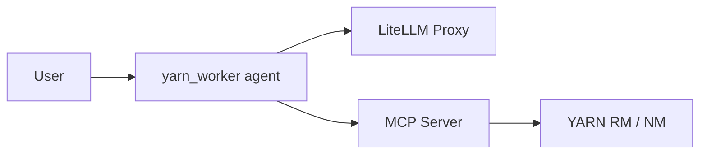

# yarn-worker

LangGraph agent for **streaming application logs** on Apache YARN. The agent uses MCP tools to resolve application restarts by name, fetch RM/NM logs, and produce an RCA-oriented summary via LiteLLM Proxy.

Requires **Python >= 3.11**.

## How it works



The agent chains three MCP tools:

1. **`yarn.getApplicationLogsByName`** — find app instances by logical name, fetch AM logs
2. **`yarn.getAppAttempts`** — get restart attempts and `logsLink` for a specific `applicationId`
3. **`yarn.tailContainerLogs`** — tail stderr/stdout from NodeManager

## Setup

```bash
python -m venv .venv
source .venv/bin/activate
pip install -r requirements.txt
cp .env.example .env
```

| Variable | Description |
|----------|-------------|
| `MCP_HOST` / `MCP_PORT` | YARN MCP server (default `127.0.0.1:8080`); tools filtered by `yarn_streaming` tag via `AgentFactory` |
| `STREAMING_APP_INSTANCE_LIMIT` | Default `3` — used in agent prompt |
| `LITELLM_API_BASE` / `LITELLM_API_KEY` / `LITELLM_MODEL` | LiteLLM proxy |

Start the MCP server before the agent. See [plan/mcp_yarn_tools_spec.md](plan/mcp_yarn_tools_spec.md) for MCP server implementation details.

## Run

### Development (no Docker)

```bash
langgraph dev
```

Starts the in-memory Agent Server at `http://127.0.0.1:2024` (hot reload). Open the Studio URL printed in the terminal. API docs: `http://127.0.0.1:2024/docs`.

### Production-like local (Docker)

```bash
# Docker running; set LANGSMITH_API_KEY in .env
langgraph up
```

Exposes the server at `http://127.0.0.1:8123` with PostgreSQL/Redis (mirrors deployment stack).

### Example invoke

Threadless streamed run for assistant `yarn_worker` (graph id from `langgraph.json`):

```bash
curl -s http://127.0.0.1:2024/runs/stream \
  -H "Content-Type: application/json" \
  -d '{
    "assistant_id": "yarn_worker",
    "input": {
      "messages": [{"role": "human", "content": "Get logs for streaming app my-streaming-app"}]
    },
    "stream_mode": "values"
  }'
```

Tool results appear in `ToolMessage` content in the streamed state values.

## Tests

```bash
pytest tests/ -q
```
