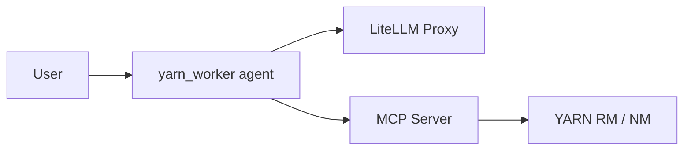

# yarn-worker

LangGraph **yarn_worker** microservice for **streaming application logs** on Apache YARN. The agent uses MCP tools to resolve application restarts by name, fetch RM/NM logs, and produce an RCA-oriented summary via LiteLLM Proxy.

Requires **Python >= 3.11**.

This repo uses a **shared worker template** with yarn-specific config in [`config/agent_config.py`](config/agent_config.py) (`mcp_tags` + system prompt). Common factory code lives in [`agents/worker.py`](agents/worker.py). Each worker type is its own microservice with its own graph id — here, `yarn_worker` (see [`langgraph.json`](langgraph.json)).

## How it works



`AgentFactory` (from **agent-util**) loads MCP tools tagged `yarn_streaming` (`mcp_tags` in `agent_config.py`) from `MCP_HOST`/`MCP_PORT`. The agent chains three tools:

1. **`yarn.getApplicationLogsByName`** — find app instances by logical name, fetch AM logs
2. **`yarn.getAppAttempts`** — get restart attempts and `logsLink` for a specific `applicationId`
3. **`yarn.tailContainerLogs`** — tail stderr/stdout from NodeManager

## Project layout

| File | Role |
|------|------|
| [`config/agent_config.py`](config/agent_config.py) | Yarn config — `mcp_tags`, prompt, `build_system_prompt()` |
| [`agents/worker.py`](agents/worker.py) | Common factory — `create_worker_agent()`; name via `get_worker_name()` in [`config/agent_config.py`](config/agent_config.py) |
| [`agents/graph.py`](agents/graph.py) | LangGraph CLI entrypoint |
| [`config/settings.py`](config/settings.py) | Runtime settings from `.env` |
| [`langgraph.json`](langgraph.json) | Graph id `yarn_worker` |

## Setup

```bash
python -m venv .venv
source .venv/bin/activate
pip install -r requirements.txt
cp .env.example .env
```

| Variable | Description |
|----------|-------------|
| `MCP_HOST` / `MCP_PORT` | YARN MCP server (default `127.0.0.1:8080`) |
| `STREAMING_APP_INSTANCE_LIMIT` | Default `3` — passed into `build_system_prompt()` |
| `LITELLM_API_BASE` / `LITELLM_API_KEY` / `LITELLM_MODEL` | LiteLLM proxy |
| `AGENT_TEMPERATURE` | Chat temperature (default `0`) |

Start the MCP server before the agent. See [LOCAL_DEVELOPMENT.md](LOCAL_DEVELOPMENT.md) for the full setup guide, or [plan/mcp_yarn_tools_spec.md](plan/mcp_yarn_tools_spec.md) for MCP server details.

## Run

### Development (no Docker)

```bash
langgraph dev
```

Starts the in-memory Agent Server at `http://127.0.0.1:2024` (hot reload). Open the Studio URL printed in the terminal. API docs: `http://127.0.0.1:2024/docs`.

### Production-like local (Docker)

```bash
# Docker running; set LANGSMITH_API_KEY in .env
langgraph up
```

Exposes the server at `http://127.0.0.1:8123` with PostgreSQL/Redis (mirrors deployment stack).

### Example invoke

Threadless streamed run for assistant `yarn_worker` (graph id from `langgraph.json`):

```bash
curl -s http://127.0.0.1:2024/runs/stream \
  -H "Content-Type: application/json" \
  -d '{
    "assistant_id": "yarn_worker",
    "input": {
      "messages": [{"role": "human", "content": "Get logs for streaming app my-streaming-app"}]
    },
    "stream_mode": "values"
  }'
```

Tool results appear in `ToolMessage` content in the streamed state values.

## Tests

```bash
pytest tests/ -q
```

## Further reading

- [LOCAL_DEVELOPMENT.md](./docs/LOCAL_DEVELOPMENT.md) — install, configure, test, troubleshoot
- [YARN_INSTALL.md](./docs/YARN_INSTALL.md) — local YARN cluster setup
